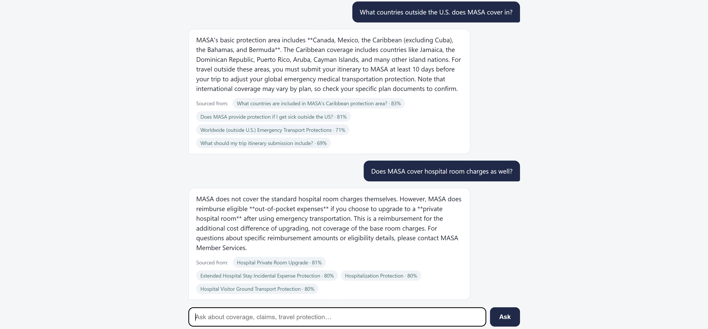

# Coverage Copilot

A small RAG (retrieval-augmented generation) app that answers member questions
about MASA's emergency medical transportation benefits, using MASA's own
public FAQ and benefits pages as its knowledge base.

> **Note**: Live deployment is currently in progress. The instructions below are for running the application locally.



## Why this domain

MASA's core product is helping members understand what's covered, when, and
under which plan tier — dense, inconsistent, real text with plan exceptions,
dollar limits, and age cutoffs (see `data/seed/benefits.json`). That's a much
more realistic "messy real-world data" problem than a clean, purpose-built
demo corpus would be, and it's specific to what this company actually does.

## Architecture

```
                    ┌─────────────┐
  React frontend ───▶  FastAPI    │
  (chat + stats)      │  /ask     │──▶ fastembed (local embedding, no API key)
                      │  /stats   │──▶ pgvector similarity search
                      └─────┬─────┘──▶ Claude API (answer generation)
                            │
                            ▼
                   Postgres (documents, query_logs)
```

- **Retrieval**: `fastembed` (ONNX, `BAAI/bge-small-en-v1.5`, 384-dim) embeds
  the query locally — no external API call or cost for this step, and it
  keeps the deploy image small compared to a full `sentence-transformers` +
  torch install.
- **Storage**: Postgres + the `pgvector` extension. Chosen deliberately over
  a dedicated vector DB since it's one extension on infrastructure you
  already know, not a new system to learn.
- **Generation**: Claude API, given only the retrieved chunks as context, with
  an explicit instruction not to invent coverage details that aren't present.
- **Monitoring**: every query, answer, retrieval hit/miss, latency, and token
  count is logged to `query_logs` and surfaced on the `/stats` endpoint and
  dashboard tab.
- **Eval**: a 12-question golden set (`backend/eval/golden_set.json`) checked
  by `backend/eval/run_eval.py`, wired into a GitHub Actions workflow that
  runs against the deployed API on every push to `main`.

## Quick Start

### Prerequisites

- **Python 3.11+** (recommend using conda/miniconda)
- **Node.js 18+** and npm
- **Anthropic API key** ([get one here](https://console.anthropic.com))
- **Supabase account** (or any Postgres database with pgvector extension)

### 1. Set up the database

1. Create a free [Supabase](https://supabase.com) project
2. In your Supabase dashboard → **Database** → **Extensions**, enable `vector`
3. Go to **Project Settings** → **Database** and copy your connection string (URI format)

### 2. Configure the backend

```bash
cd backend
cp .env.example .env
# Edit .env and add:
#   ANTHROPIC_API_KEY=sk-ant-...
#   DATABASE_URL=postgresql://postgres:[password]@[host]:5432/postgres
```

### 3. Install Python dependencies

```bash
# Create a conda environment (recommended)
conda create -n coverage-copilot python=3.11 -y
conda activate coverage-copilot

# Install dependencies
pip install -r requirements.txt
```

### 4. Load the data

```bash
# From the backend directory
python -m scraper.ingest
```

This will:
- Create the database tables (`documents`, `query_logs`)
- Embed and load 43 chunks from MASA's public FAQ and benefits pages

### 5. Start the backend

```bash
# From the backend directory
python -m uvicorn app.main:app --reload
```

Backend runs on http://127.0.0.1:8000

### 6. Start the frontend

```bash
cd frontend
npm install
npm run dev
```

Frontend runs on http://localhost:5173

### 7. Try it out

Open http://localhost:5173 and ask questions like:
- "Am I covered for air transport abroad?"
- "What's the difference between MASA MTS and MASA TRS?"
- "Does MASA cover ground ambulance services?"

Click the **Dashboard** tab to see query logs, retrieval metrics, latency, and token usage.


## Refreshing the corpus

`backend/scraper/scrape_masa.py` re-scrapes MASA's public pages into the same
JSON shape as `data/seed/`. Add more URLs to the `PAGES` list (e.g. individual
`/benefits/<slug>/` detail pages) to grow the corpus, then re-run
`scraper.ingest` to reload it.

## Known limitations

- No authentication — a good next step would be an LLM-graded eval instead.
- No real drift detection; the `/stats` retrieval-hit-rate is the closest proxy available
  without live usage data.
